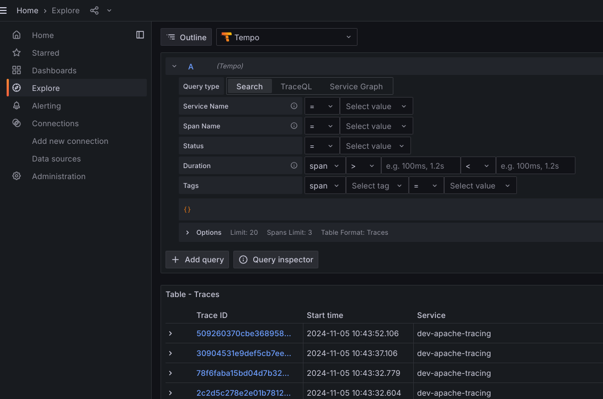
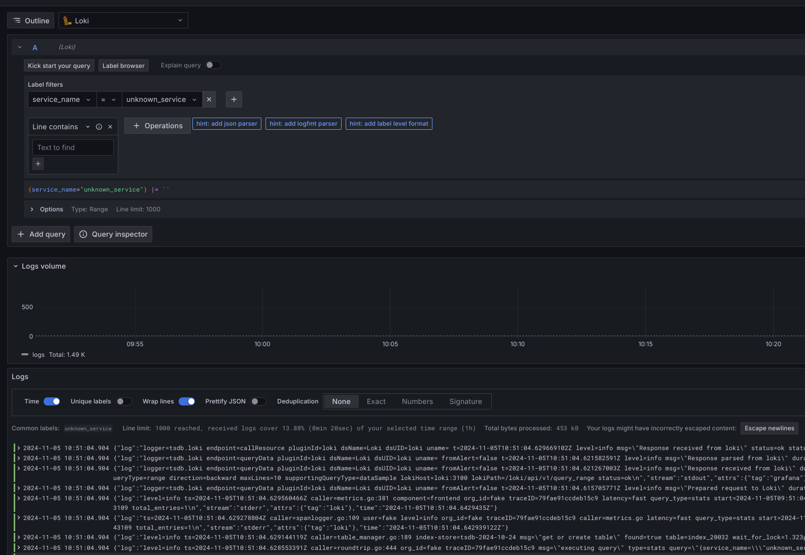
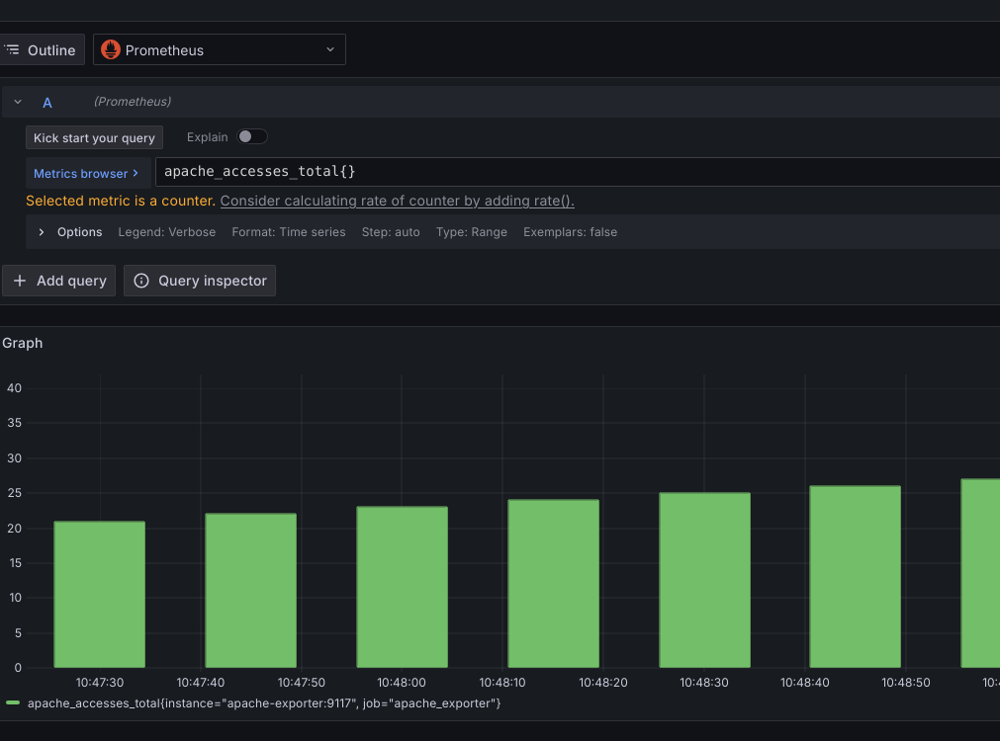

# Apache Tracing

## Introduction
This is a simple example of how to use Apache Tracing with OpenTelemetry. This example uses OpenTelemetry Apache instrumentation.
It also uses OpenTelemetry Collector to receive logs and export them to Loki.
And lastly, it uses Prometheus to collect metrics from Apache Exporter and Grafana to visualize them.

## Requirements
- Docker
- Docker Compose plugin https://docs.docker.com/compose/install/linux/

## How to run
1. Clone this repository and go to the directory where it was cloned
```bash
git clone https://github.com/pablogrs/apache-tracing.git && \
cd apache-tracing
```
2. Run the script to build the images for Apache and Otel Collector and run the compose up
```bash
./compose-up-architecture-based.sh
```
3. Destroy the containers by running
```bash
docker compose down
```

## Checking Traces
Access Grafana, open your browser and go to `http://localhost:3000`.
Browse to the Explore and select Tempo from the datasources, run the query and you should see a dashboard with 
traces from server-status (Apache exporter accessing mod_status). 


Go to the local website `http://localhost:8080` to generate more traces

# Checking Docker logs
Access Grafana, open your browser and go to `http://localhost:3000`.
Browse to the Explore and select Loki from the datasources, run the query and you should see lots of logs from 
all the containers, bare in mind these are not parsed, so it is messy.


# Checking Prometheus metrics
Access Grafana, open your browser and go to `http://localhost:3000`.
Browse to the Explore and select Prometheus from the datasources, select a metrics and run the query.
Metrics are collected from Apache Exporter, Grafana tempo is also sending metrics.



## References
- [OpenTelemetry](https://opentelemetry.io/)
- [OpenTelemetry Collector](https://github.com/open-telemetry/opentelemetry-collector-contrib)
- [OpenTelemetry Apache Instrumentation](https://opentelemetry.io/blog/2022/instrument-apache-httpd-server/#installing-opentelemetry-module-in-target-system)
- [Prometheus](https://prometheus.io/)
- [Grafana](https://grafana.com/)
- [Loki](https://grafana.com/oss/loki/)
- [Tempo](https://grafana.com/oss/tempo/)
- [Apache Exporter](https://github.com/Lusitaniae/apache_exporter)
- More references inline in the code
